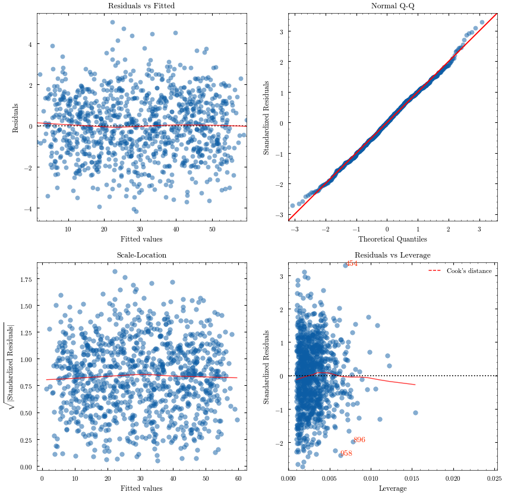

# OlsCheck

`olscheck` is a Python library designed to check and visualize the assumptions of Ordinary Least Squares (OLS). This tool streamlines the process of model diagnostics, offering an all-in-one solution for analyzing residuals, leverage, and multi-collinearity.

 
*Sample of Residuals vs Fitted values visualization*

## Features

- **Residuals vs Fitted Plot**: Visualize potential non-linear patterns.
- **QQ-Plot**: Check the normality of residuals.
- **Scale-Location Plot**: Confirm homoscedasticity.
- **Leverage Plot**: Identify influential cases.
- **VIF Test**: Assess multi-collinearity among predictors.

## Background

Much of the code for this library is inspired by [Statsmodels](https://www.statsmodels.org/devel/examples/notebooks/generated/linear_regression_diagnostics_plots.html). However, the Statsmodels implementation is tightly coupled with its own components, making it challenging to use if you are employing OLS from a different library.

`OlsCheck` provides a straightforward alternative for generating key diagnostic plots that assess the assumptions underlying Ordinary Least Squares (OLS) regression. The library internally calculates residuals, leverage, and studentized residuals to deliver these insights.


## Installation

```bash
pip install olscheck
```

## Development setup (uv)

```bash
uv sync --group test
uv run pytest
```
